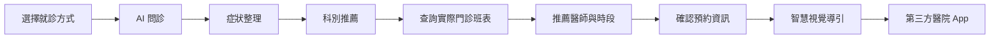
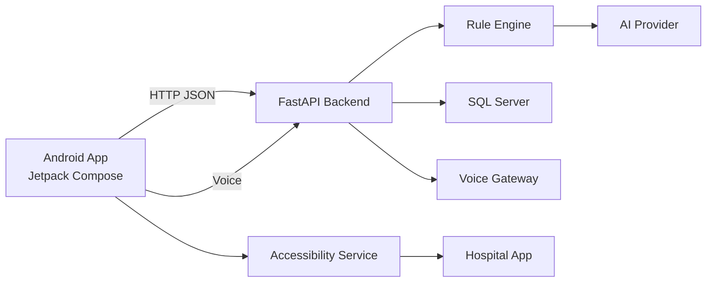

# 導底看哪科－智慧看診指南

> AI 智慧醫療掛號導引系統  
> 從症狀描述、科別判斷、醫師推薦，到第三方醫院 App 掛號導引的一站式 Android 應用。

「導底看哪科」主要面向高齡者、不熟悉智慧型手機操作的使用者，以及偏好以國語／台語進行互動的族群。

系統透過自然語言問診整理使用者的症狀與看診需求，協助判斷適合的就診科別，再結合實際門診班表與醫師資訊產生推薦結果。完成選擇後，可透過 Android Accessibility Service 提供跨 App 的智慧視覺導引，引導使用者前往醫院 App 完成掛號。

---

## 核心功能

### 1. AI 智慧問診

使用者可以以自然語言描述身體不適，系統逐步整理：

- 主要症狀
- 身體部位
- 持續時間
- 嚴重程度
- 伴隨症狀
- 危險徵兆
- 可看診日期與時段
- 醫師與專長偏好

Backend 以 deterministic checklist 與安全檢查控制問診流程，AI 主要協助自然語言理解與資訊整理，避免將完整決策交由生成式模型處理。

### 2. 科別推薦

系統依據整理後的症狀證據建立適合的就診科別，並與正式科別資料進行比對。

目前 MockDemo 初診案例示範：

```text
右膝疼痛
＋ 上下樓梯與走久時較明顯
＋ 偶爾腫脹
＋ 無明顯外傷
        ↓
建議科別：一般骨科
```

### 3. 醫師與門診推薦

科別確定後，Backend 從 SQL Server 查詢實際班表，再依：

- 醫師專長
- 可看診日期
- 上午／下午時段
- 使用者偏好
- 初診／複診類型

產生推薦結果。

介面提供不同排序方式，讓使用者可以依「專長優先」或「時間優先」選擇適合的醫師。

### 4. 國語／台語語音互動

系統設計國語與台語語音互動管線，包括：

- 語音輸入
- ASR 語音辨識
- TTS 語音播報
- Android 系統語音降級機制
- 預錄語音 Demo

目前 MockDemo 初診流程使用固定劇本與預錄語音，以降低展示過程中的網路與外部服務依賴。

一般問診的語音服務則可透過 Voice Gateway 串接外部 ASR／TTS 模型。

### 5. 智慧視覺導引

系統使用 Android `AccessibilityService` 與 Overlay 技術，在第三方醫院 App 上顯示紅框提示。

掛號流程可依序引導使用者：

```text
選擇掛號
    ↓
選擇科別
    ↓
選擇日期
    ↓
選擇醫師
    ↓
填寫資料
    ↓
確認掛號
```

此設計不需要修改醫院既有 App，也不需要院方額外提供操作 API。

目前示範對象為臺北榮總行動就醫服務 App。

### 6. 掛號紀錄與取消導引

系統保留使用者的問診與推薦結果，並依狀態區分：

- 已完成
- 未完成
- 已取消

對已完成的掛號紀錄，也可啟動取消掛號的智慧視覺導引。

---

## 使用流程



目前提供三種就診方式：

| 模式 | 說明 |
|---|---|
| 初診 | 第一次至醫院就診，進行症狀問診與推薦 |
| 複診 | 曾於醫院就診，可進行問診並查詢複診班表 |
| 快速查詢 | 已知道科別，直接依條件查詢門診班表 |

---

## MockDemo

目前 `mockdemo` 分支提供一套適合展示與錄影的初診流程。

```text
VisitTypeSelection
        ↓
初診
        ↓
Chat
固定右膝疼痛問診劇本
        ↓
一般骨科
        ↓
POST /mock-demo/prepare
        ↓
DoctorSelection
查詢真實 SQL 班表
        ↓
選擇醫師
        ↓
POST /generate_script
        ↓
ConfirmNeed
        ↓
智慧視覺導引
```

### MockDemo 中固定與即時的部分

| 功能 | 資料來源 |
|---|---|
| 初診聊天內容 | 固定 Demo Script |
| 症狀案例 | 固定右膝疼痛案例 |
| 推薦科別 | 一般骨科 |
| 醫師／日期／門診 | 即時 SQL Server 班表 |
| 掛號導引腳本 | Backend 產生 |
| 聊天語音 | App 內預錄語音 |

因此 MockDemo 並不是完全假資料：

> 前段問診保持展示穩定，後段醫師與班表仍使用正式資料來源。

更完整的 MockDemo 修改紀錄請參考 [`MOCKDEMO_CHANGES.md`](MOCKDEMO_CHANGES.md)。

---

## 系統架構



### Android

負責：

- Jetpack Compose UI
- Navigation
- 問診畫面
- 醫師推薦畫面
- 歷史紀錄
- 語音輸入與播放
- Accessibility Service
- Overlay 智慧視覺導引

### Backend

負責：

- 問診狀態管理
- 症狀資訊整理
- Red Flag 安全檢查
- 科別判斷
- 班表查詢
- 醫師推薦
- 掛號腳本產生
- AI Provider 串接
- Voice Gateway 串接

---

## 技術

| 類別 | 技術 |
|---|---|
| Android | Kotlin |
| UI | Jetpack Compose / Material 3 |
| 架構 | MVVM |
| Navigation | Navigation Compose |
| 後端 | Python / FastAPI |
| API | HTTP JSON / Multipart |
| Database | SQL Server / pyodbc |
| AI | Cerebras `gpt-oss-120b` |
| Voice | ASR / TTS Voice Gateway |
| Accessibility | Android AccessibilityService |
| 視覺導引 | Android Overlay |
| 測試 | JUnit / pytest |

目前 Android 專案設定：

- `minSdk 24`
- `targetSdk 36`
- Kotlin `2.2.10`
- Android Gradle Plugin `9.0.0`

---

## 專案結構

```text
HelloProject/
│
├─ android/
│  └─ app/
│     └─ src/main/java/com/example/medicalaiguidance/
│        ├─ demo/
│        ├─ model/
│        ├─ navigation/
│        ├─ network/
│        ├─ repository/
│        ├─ screen/
│        ├─ service/
│        ├─ util/
│        └─ viewmodel/
│
├─ backend/
│  ├─ app/
│  │  ├─ routes/
│  │  └─ services/
│  ├─ tests/
│  └─ requirements.txt
│
├─ scripts/
│  ├─ setup.ps1
│  ├─ run-backend.ps1
│  ├─ test-backend.ps1
│  ├─ test-android.ps1
│  └─ test-all.ps1
│
├─ .env.example
├─ MOCKDEMO_CHANGES.md
└─ README.md
```

---

## 本機執行

### 1. Clone

```bash
git clone -b mockdemo https://github.com/melody650123/HelloProject.git
cd HelloProject
```

### 2. Backend 環境

Windows PowerShell：

```powershell
.\scripts\setup.ps1
```

將 `.env.example` 複製為：

```text
backend/.env
```

並依本機環境填入必要設定。

例如：

```env
DB_DRIVER=ODBC Driver 17 for SQL Server
DB_SERVER=
DB_NAME=
DB_USER=
DB_PASSWORD=

AI_PROVIDER=cerebras
CEREBRAS_API_KEY=

VOICE_ENABLED=false
VOICE_GATEWAY_URL=http://localhost:8000
VOICE_GATEWAY_KEY=
```

> `.env` 含有本機設定與敏感資訊，不應提交至 GitHub。

### 3. 啟動 Backend

```powershell
.\scripts\run-backend.ps1 -Port 8080 -HostName 0.0.0.0
```

測試：

```powershell
Invoke-RestMethod http://127.0.0.1:8080/health
```

正常應回傳：

```json
{
  "status": "ok"
}
```

### 4. Android API 位址

建立或修改：

```text
android/local.properties
```

Android Emulator：

```properties
API_BASE_URL=http://10.0.2.2:8080
```

實體手機與 Backend 位於同一區域網路時：

```properties
API_BASE_URL=http://<Backend電腦IP>:8080
```

例如：

```properties
API_BASE_URL=http://192.168.1.100:8080
```

> `local.properties` 為本機設定，不應提交至 GitHub。

### 5. Build Android

```powershell
cd android

.\gradlew.bat testDebugUnitTest --no-daemon
.\gradlew.bat assembleDebug --no-daemon
```

APK 產生於：

```text
android/app/build/outputs/apk/debug/app-debug.apk
```

---

## Backend 測試

```powershell
.\scripts\test-backend.ps1
```

或執行完整 baseline：

```powershell
.\scripts\test-all.ps1
```

---

## 目前限制

本專案仍屬研究與原型開發階段。

目前需要注意：

- MockDemo 的醫師與日期會依 SQL Server 實際班表改變。
- Voice Gateway 為外部服務，未啟動時部分 ASR／TTS 功能不可使用。
- Backend case store 目前為 in-memory，不適合正式多節點部署。
- Accessibility 視覺導引依第三方 App UI 結構運作，若院方 App 更新介面，導引腳本可能需要重新調整。
- MockDemo 初診主要以固定劇本確保展示穩定，並不代表所有正式問診流程皆使用固定回答。

---

## 隱私與安全

Repository 不應包含：

- Database password
- API Key
- Voice Gateway Key
- 個人本機 IP
- `.env`
- `local.properties`

請使用 `.env.example` 作為設定範本。

---

## 免責聲明

本系統為學術研究與原型展示用途。

系統提供的症狀整理、科別推薦與掛號協助不能取代專業醫療診斷。若使用者出現嚴重或緊急症狀，應立即尋求正式醫療協助。

---

## Project Status

目前重點流程為：

**Android 問診 → 科別推薦 → 真實門診班表 → 醫師選擇 → 預約資訊確認 → 智慧視覺掛號導引**

MockDemo 已提供可展示的完整初診流程。
